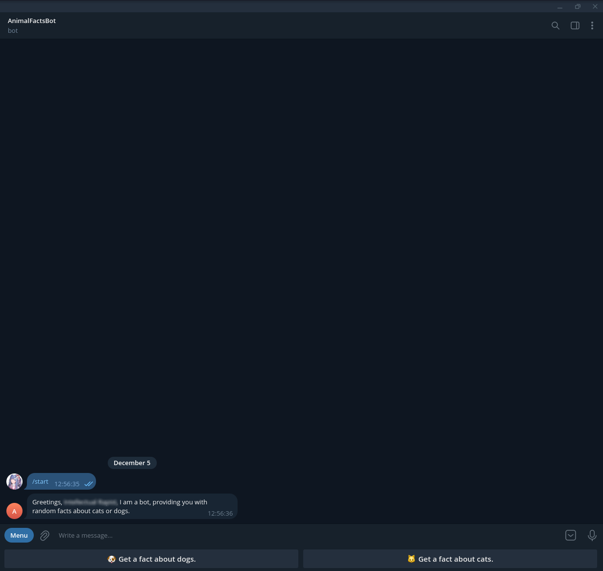

# AnimalFactsBot
Телеграм-бот, отправляющий случайные факты о животных и случайные фотографии
соответствующих животных. Разработан в рамках курса "Разработка и Анализ Требований".

# 1. Описание проекта
Данный проект представляет собой примитивного телеграм-бота, использующего открытые API
для отправки пользователям случайных фактов о животных и случайных фотографий
данных животных в ответ на запрос пользователя. На данный момент проект поддерживает только кошек и собак.

Проект сделан в соответствии с [техническим заданием](docs/Техническое%20задание%20для%20проекта%20Телеграм-бот%20со%20случайными%20фактами%20о%20животных.pdf). 

Также проект поддерживает 2 языка: русский и английский. Язык зависит от выбранного
пользователем языка в Telegram. 

Проект разработан на Python 3.11 с использованием следующих библиотек:
```
aiogram~=3.2.0
requests~=2.31.0
Pillow~=10.1.0
googletrans~=4.0.0rc1
langcodes~=3.3.0
```

Существующие проблемы и перспективы:
- 'Кривая' реализация перевода и поддерживаются только 2 языка.
- Язык Telegram не всегда корректно распознается и распознавание языка требует доработки.
- API фотографий собак не всегда корректно возвращает фотографию.
- Добавление возможности отправки фактов не только о кошках и собаках.
# 2. Установка и запуск проекта
Для установки проекта достаточно загрузить архив и распаковать его в свободную папку.

Запуск проекта может быть осуществлён 2 путями:

1.  Напрямую, запустив файл 'animalfactsbot.py':
    ```
    token='ваш токен' python ./animalfactsbot.py
    ```
    Укажите токен вашего бота в переменной окружения, заменив 'ваш токен'. Или же напрямую в файле animalfactsbot.py,
заменив аргумент 'token=' в конструкторе объекта Bot.
2.  С использованием Docker:

    Сперва нужно осуществить сборку образа Docker проекта.
    ```
    docker build -t python-animalfactsbot .
    ```
    В данной команде используется встроенный builder Docker, который является устаревшим. 
Рекомендуется использовать Buildkit:  https://docs.docker.com/go/buildx/.
    
    Не забудьте указать ваш токен в файле docker-compose.yml.
    
    Это можно сделать как с помощью переменной окружения:
    ```
    docker-compose.yml
        environment:
          - token=YOUR_TOKEN
    ```
    Так и создав отдельный файл credentials.env, содержащий ваш токен. Данный подход используется по умолчанию.
    ```
    credentials.env
        token = "Ваш токен"
    ```
    
    ```
    docker-compose.yml
        env_file:
         - credentials.env
    ```
    После чего можно запустить проект, используя docker-compose.
    ```
    docker-compose up
    ```
<b> Примечание: </b>Для получения токена бота Telegram необходимо обратиться к боту 

[BotFather](https://t.me/BotFather).

# 3. Использование проекта
После успешной установки и запуска проекта для взаимодействия с ботом можно использовать интерфейс Telegram.

Для инициализации бота используется команда /start.


После чего можно использовать клавиатуру снизу от поля ввода или команды /catfact и /dogfact для получения соответствующих фактов.


В том случае, если меню скрылось, его можно снова вызвать, используя соответствующие элементы интерфейса.


# 4.Использованные API
- [MeowFacts](https://github.com/wh-iterabb-it/meowfacts) - Факты о кошках.
- [Cats As A Service](https://cataas.com/) - Фотографии кошек.
- [DogApi](https://dogapi.dog/) - Факты о собаках.
- [DogCeo](https://dog.ceo/) - Фотографии собак.

    
   